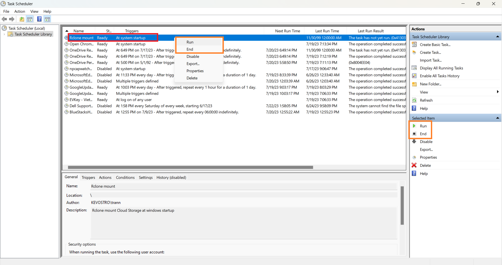

# Setup Windows Task Scheduler

Step 1: Open Task Scheduler

Open **Windows Search** _(<mark style="color:purple;">Windows + S</mark>)_\
_Search for:_ <mark style="color:yellow;">`Task Scheduler`</mark>\

Step 2: Create Task

1. In <mark style="color:yellow;">**Task Scheduler Library**</mark>, click on <mark style="color:yellow;">**Create Basic Task...**</mark>\
   

<!---->

2. Create task's **Name** and **Description**\
   

<!---->

3. Choose <mark style="color:yellow;">**When the computer starts**</mark>\
   

<!---->

4. Choose <mark style="color:yellow;">**Start a program**</mark>\
   

<!---->

5. Enter your Rclone mount command\
   

<!---->

6. It will ask to move the arg into arguments field, choose <mark style="color:yellow;">**Yes**</mark>\
   

<!---->

7. Click on <mark style="color:yellow;">**Open the Properties diaglog for this task when click Finish**</mark>\
   

Step 3: Settings for Task

1. Click on <mark style="color:yellow;">**Change User or Group...**</mark>\
   

<!---->

2. Click on <mark style="color:yellow;">**Advanced...**</mark>\
   

<!---->

3. <mark style="color:yellow;">**Find now**</mark>, choose <mark style="color:yellow;">**SYSTEM**</mark>, <mark style="color:yellow;">**OK**</mark> and <mark style="color:yellow;">**OK again**</mark> get to back to Task Properties\
   

<!---->

4. In the **Conditions** tab, untick <mark style="color:yellow;">**Start the task only if the computer is on AC power**</mark>\
   

<!---->

5. You can edit more in **Settings** tab...\
   

Step 4: Run / Stop Task

* You can run or stop it immediately in **Windows Task Scheduler**\
  

<!---->

* Also, you can stop it via **Task Manager**

<!---->

* Every time your computer boots up, it will start Rclone mount before the user logon

